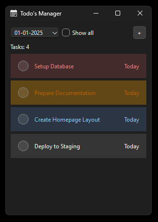
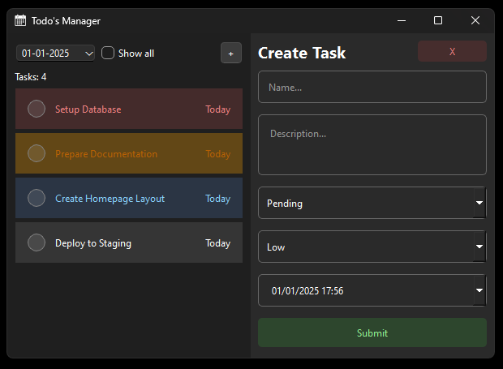
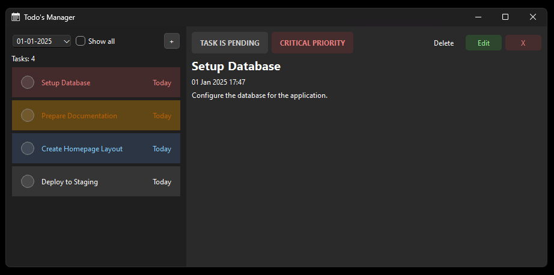
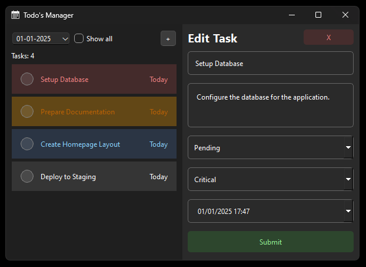
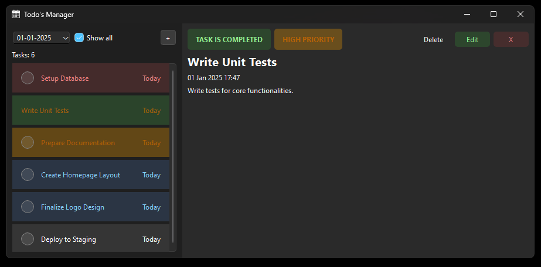

# 📅 Personal Task Manager ✅

A simple and efficient **Personal Task Manager** application built with Python, designed to help you organize your tasks and keep track of your daily activities. Whether it's managing your to-dos or setting up reminders, this app has you covered! 📝🎯

## Features ✨

- ✅ **Add, View, and Delete TODO items** – Manage your tasks with ease.
- 🗓️ **Simple and intuitive interface** – Designed for simplicity and speed.
- 📅 **Track your daily agenda** – Stay on top of your tasks and never forget an important to-do.
- 🕒 **Task completion status** – Keep track of which tasks are done and which need attention.

## Preview 📸

Here are some screenshots of the app in action:

### Task Manager Interface


### Add New Tasks


### View Tasks


### Edit Task


### Inspect all tasks also that are cancelled or completed


## Installation 🔧

### Prerequisites 📦

1. **Python 3.9+** is required to run the app. Ensure it's installed on your system.

2. Install the required dependencies listed in `requirements.txt`. Run the following command after cloning the repository:

   ```bash
   pip install -r requirements.txt